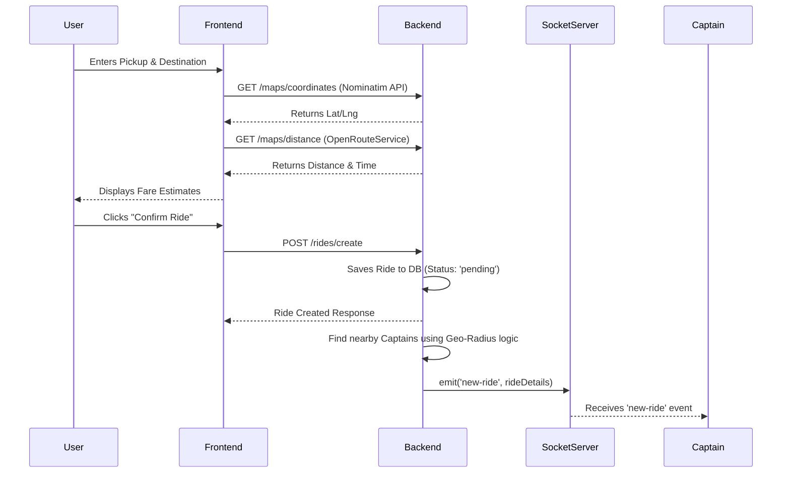
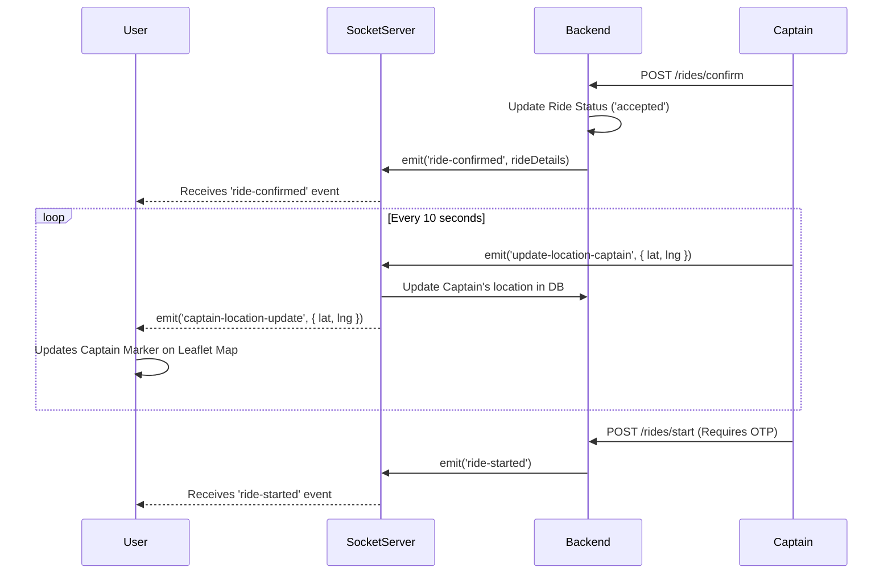

# Ryde - Modern Ride-Sharing Platform

Ryde is a full-stack, real-time ride-sharing application designed to seamlessly connect riders (Users) with drivers (Captains). Built with a modern tech stack, it features live GPS tracking, dynamic routing, secure authentication, and real-time socket communication.

---

## 🚀 Features

### For Users (Riders)
- **Secure Authentication**: Register and login securely using JWT tokens.
- **Smart Location Search**: Autocomplete suggestions for pick-up and destination using OpenStreetMap Nominatim API.
- **Fare Estimation**: Dynamic fare calculation based on distance, time, and vehicle type (Car, Auto, Moto).
- **Live Ride Tracking**: Real-time map rendering showing the route and the approaching Captain's live location.
- **Ride History**: View past rides and receipts.

### For Captains (Drivers)
- **Dedicated Portal**: Separate registration, login, and dashboard tailored for drivers.
- **Vehicle Registration**: Register specific vehicle categories (Car, Auto, Moto) with capacity and plate number.
- **Live Ride Requests**: Receive real-time ride requests from nearby users based on geographical radius.
- **Turn-by-Turn Navigation**: Real-time route polylines and live tracking using OpenRouteService.
- **Ride Management**: Accept, start, complete, or cancel rides effortlessly.

---

## 🛠 Tech Stack

**Frontend:**
- React.js (Vite)
- Tailwind CSS & GSAP for sleek, performant animations
- React Router DOM
- Leaflet & React-Leaflet for interactive maps
- Axios for API communication
- Socket.io-client for real-time events

**Backend:**
- Node.js & Express.js
- MongoDB & Mongoose (Database)
- Socket.io for bidirectional real-time communication
- JSON Web Tokens (JWT) & bcrypt for secure authentication
- OpenRouteService API for distance, duration, and route polyline generation
- OpenStreetMap Nominatim API for geocoding and reverse geocoding

---

## 📐 System Architecture & Data Flow

### 1. Ride Booking Flow



### 2. Ride Acceptance & Live Tracking Flow



---

## 📂 Folder Structure

```text
Ryde/
├── backend/
│   ├── lib/              # Database connection logic
│   ├── services/         # Map & utility services
│   ├── src/              # Core Logic
│   │   ├── controllers/  # Route handlers
│   │   ├── middlewares/  # Auth & Validation
│   │   ├── models/       # Mongoose DB Schemas
│   │   └── routes/       # API Definitions
│   ├── server.js         # Entry Point
│   ├── socket.js         # Socket.io Configuration
│   ├── Dockerfile        # Backend Container Info
│   └── .env              # Backend Env variables
├── frontend/
│   ├── public/           # Static assets
│   ├── src/              # React Application
│   │   ├── components/   # Reusable UI components
│   │   ├── context/      # React Providers (User, Captain, Sockets)
│   │   └── pages/        # Views (Home, Login, Riding, etc.)
│   ├── vite.config.js    # Vite configuration
│   ├── Dockerfile        # Frontend Container Info
│   └── .env              # Frontend Env variables
└── docker-compose.yml    # Main Docker Compose entry
```

---

## ⚙️ Environment Variables

Create a `.env` file in the `backend` and `frontend` directories with the following variables:

### Backend `.env`
```env
PORT=3000
DB_CONNECT=mongodb://your_mongo_db_connection_string
JWT_SECRET=your_jwt_secret_key
ORS_API_KEY=your_open_route_service_api_key
```

### Frontend `.env`
```env
VITE_BASE_URL=http://localhost:3000/api/v1
```

---

## 💻 Local Setup & Installation

### Prerequisites
- Node.js (v18+)
- MongoDB running locally or a MongoDB Atlas URI
- OpenRouteService API Key (Free tier available)

### Quick Start

1. **Clone the repository:**
   ```bash
   git clone https://github.com/your-username/ryde.git
   cd ryde
   ```

2. **Backend Setup:**
   ```bash
   cd backend
   npm install
   # Create your .env file here
   npm run dev # Starts server with nodemon
   ```

3. **Frontend Setup:**
   ```bash
   cd frontend
   npm install
   # Create your .env file here
   npm run dev # Starts Vite server
   ```

4. **Access the App:**
   Open your browser and navigate to `http://localhost:5173`.

---

## 🛡 Security & Production Readiness
To ensure Ryde is production-ready, the following practices have been implemented:
1. **Protected Routes & Middleware**: All sensitive API endpoints are protected using JWT token verification (`authUserOrCaptain` middleware).
2. **Password Hashing**: User and Captain passwords are encrypted using `bcrypt` before database insertion.
3. **Token Blacklisting**: Implemented a logout mechanism that blacklists JWT tokens to prevent reuse.
4. **Data Validation**: API payloads are strictly validated using `express-validator` to prevent malicious injection or incomplete requests.
5. **CORS & HTTP Cookies**: Authentication tokens are securely transferred via `httpOnly` cookies, preventing XSS attacks.
6. **Graceful Error Handling**: Fallbacks are built-in for external APIs (e.g., Nominatim rate limits) to prevent the entire node process from crashing.
